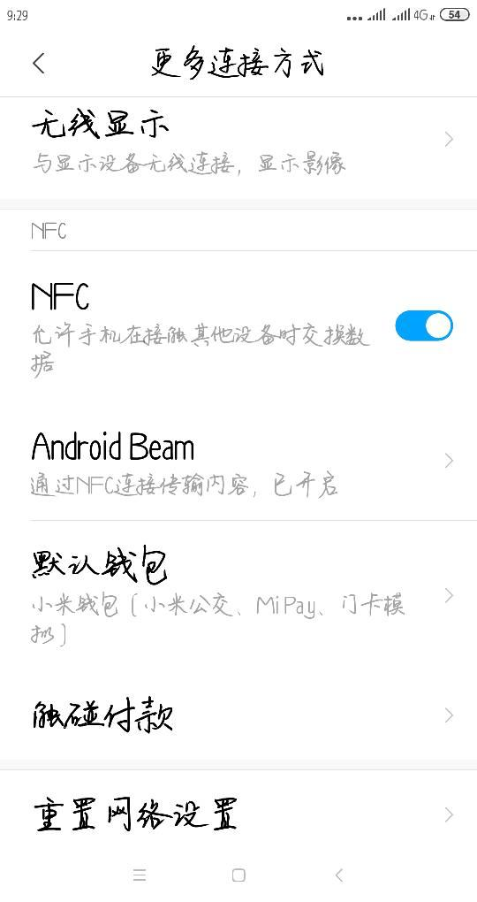
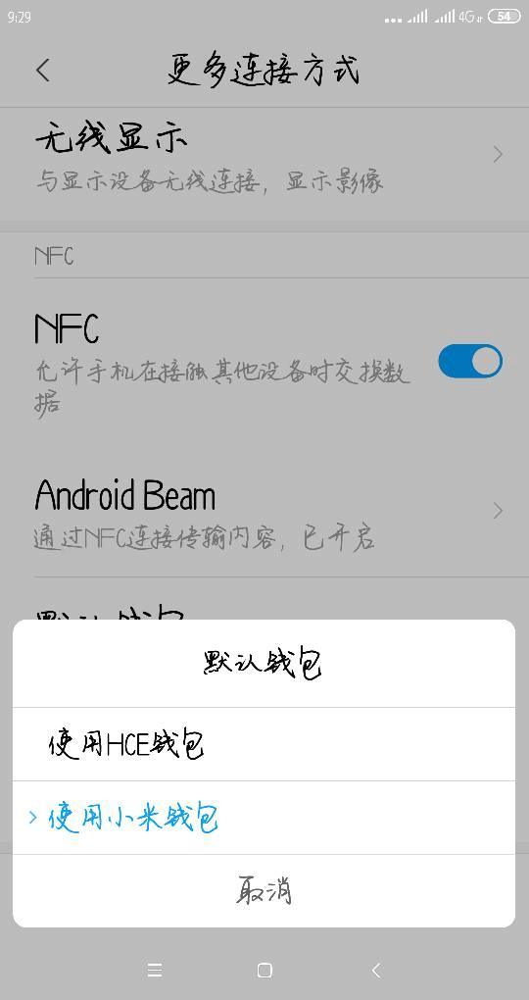

# GooglePayNfc

基于主机的卡模拟，原理：将手机作为一个 CPU 卡，与 NFC 读头进行交互，实现具体需求，比如支付、门禁等。

## 前提条件

1. 手机必须支持 NFC 功能
2. 手机必须打开 NFC 功能
3. 手机必须处于亮屏状态「可以是锁屏状态下的亮屏」
4. 模拟卡手机与读卡器或另一读卡手机必须使用相同 AID；

## 手机设置

1. 打开 NFC 功能
2. 如果是模拟支付类型的卡，需要检查是否为默认支付应用，如果不是，需要将其设置为默认支付应用
3. 如果是模拟其他类型的卡，实际测试下来多款手机，无需检查是否为默认应用，但建议检查并设置为默认应用；
4. 如果手机 NFC 设置中有 HCE 选项或类似选项，需要打开（多出现在国内系统上，以小米为例）；

## 读写流程

### 名词解释

- 读头：读卡器或另一手机，CPU 卡：模拟卡手机；
- SELECT AID 指令：读头向 CPU 卡发送的第一条指令，用于选择应用，此时手机上如果存在多个应用，会弹出选择应用的对话框，选择后，CPU 卡会返回应用的 AID；
- APDU 指令：具体的交互协议，读头和 CPU 卡之间的交互协议；

###  交互流程

1. 读头向 CPU 卡发送 SELECT AID 指令，CPU 卡返回 AID
2. 读头向 CPU 卡发送 APDU 指令，CPU 卡返回 APDU 指令

### 底层交互

不同手机，底层的协议交互可能有所不同，已知的有以下 2 种情况：

#### 情况 1

1. 读头向 CPU 卡发送 SELECT AID 指令或 APDU 指令
2. CPU 卡返回 ACK，带有多少时间，表示读头应在多少时间后获取 CPU 卡返回的信息；

#### 情况 2

1. 读头向 CPU 卡发送 SELECT AID 指令或 APDU 指令
2. CPU 卡立即返回 APDU 指令